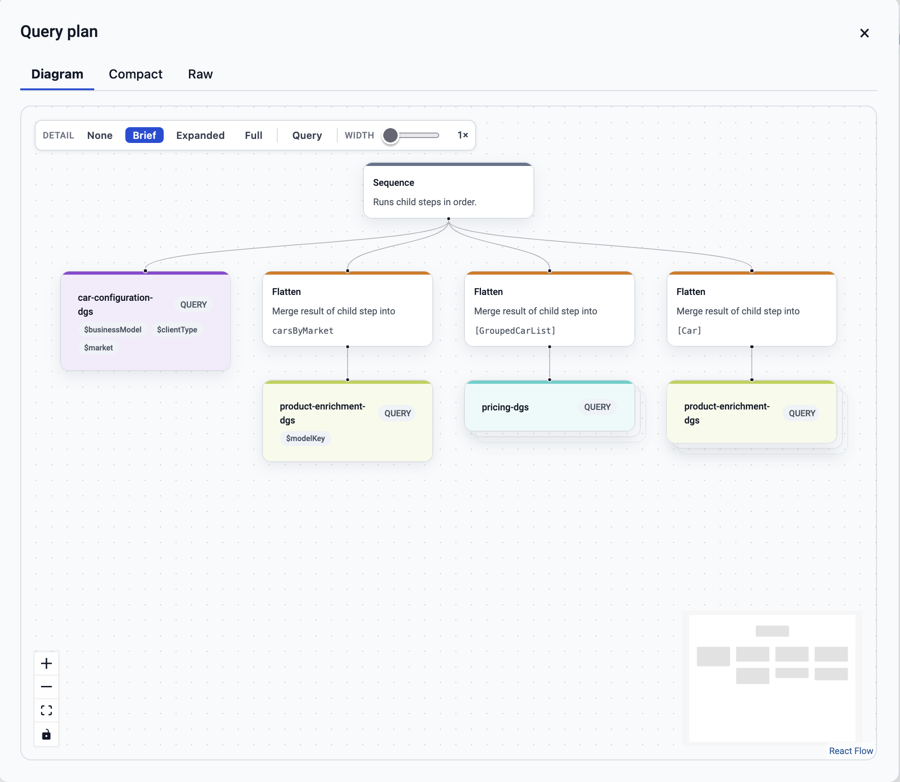

# graphiql-plugin-apollo-query-plan

Apollo Federation query plan visualiser for GraphiQL. Visualizes the Apollo Router (or Apollo Gateway) execution strategy as an interactive React Flow diagram, a syntax-highlighted compact view, and a raw JSON editor.



The package works by sending along headers as described [here](https://www.apollographql.com/docs/graphos/schema-design/federated-schemas/reference/query-plans#viewing-query-plans) and then inspecting the response data in `extensions`.

- For standalone Apollo Router deployments [these headers](https://www.apollographql.com/docs/graphos/schema-design/federated-schemas/reference/query-plans#outputting-query-plans-with-headers) are sent, and the relevant data is found in `extensions.apolloQueryPlan`.
- For standalone Apollo Gateway deployments [these headers](https://www.apollographql.com/docs/graphos/schema-design/federated-schemas/reference/query-plans#legacy-header-options) are sent, and the relevant data is found in `extensions.__queryPlanExperimental`.

This package is primarily built for Apollo Router but it works for Apollo Gateway too, due to a compatibility layer which converts the gateway response format into the router response format before processing and visualizing the response.

## Install

```sh
pnpm add graphiql-plugin-apollo-query-plan
npm install graphiql-plugin-apollo-query-plan
```

You must also import the stylesheet once in your app:

```ts
import "graphiql-plugin-apollo-query-plan/style.css";
```

> **Import location matters in SSR frameworks.** In Next.js (App Router or Pages Router), CSS imports are only processed when they appear in a layout, page, or `_app` file, not in arbitrary component files. Import the stylesheet in your root layout or the top-level component that owns your `<GraphiQL>` instance, not inside the component that renders the button.

> **Client-side only.** This is a GraphiQL plugin which supports system theme — all components must render in the browser. The light/dark mode detection reads `document.documentElement` and will return `'light'` during SSR. Wrap the components in a client boundary (e.g. Next.js `'use client'`) if your app uses server rendering.

## Usage

### Simple — built-in dialog

Drop `QueryPlanReactFlowButton` into the GraphiQL toolbar. It reads the `fetcher`, `queryEditor`, and `variableEditor` directly from the GraphiQL store.

```tsx
import { GraphiQL } from "graphiql";
import { QueryPlanReactFlowButton } from "graphiql-plugin-apollo-query-plan";
import "graphiql-plugin-apollo-query-plan/style.css";

function MyGraphiQL() {
  const handleError = (label: string, message: string) => {
    console.error(label, message);
  };

  return (
    <GraphiQL fetcher={fetcher}>
      <GraphiQL.Toolbar>
        {() => <QueryPlanReactFlowButton onError={handleError} />}
      </GraphiQL.Toolbar>
    </GraphiQL>
  );
}
```

When the button is clicked, it sends the proper headers to your federated endpoint and reads the query plan from the response extensions, and finally opens a built-in native `<dialog>` with three tabs: Diagram, Compact, and Raw.

---

### Advanced — custom dialog / modal

Use `renderPanel` to wrap the view components in your own dialog or drawer. The function receives the fetched plan and a `close` callback.

```tsx
import {
  QueryPlanReactFlowButton,
  QueryPlanDiagram,
  QueryPlanCompact,
  QueryPlanRaw,
} from "graphiql-plugin-apollo-query-plan";

<QueryPlanReactFlowButton
  onError={handleError}
  renderPanel={(plan, close) => (
    <MyDesignSystemDialog onClose={close} title="Query plan">
      <MyTabs>
        <MyTab label="Diagram">
          {/* isReady delays React Flow mounting until your dialog animation settles */}
          <QueryPlanDiagram plan={plan} isReady={dialogAnimationDone} />
        </MyTab>
        <MyTab label="Compact">
          <QueryPlanCompact plan={plan} />
        </MyTab>
        <MyTab label="Raw">
          <QueryPlanRaw plan={plan} />
        </MyTab>
      </MyTabs>
    </MyDesignSystemDialog>
  )}
/>;
```

`QueryPlanDiagram` manages its own controls (detail level, node width, show/hide subgraph queries) internally. Pass `isReady={false}` while your dialog is animating in — React Flow uses `getBoundingClientRect()` which returns wrong positions during CSS transforms. Flip to `true` once the animation has settled.

A reliable way to detect this is to listen for the dialog's `transitionend` event:

```tsx
const dialogRef = React.useRef<HTMLDialogElement>(null);
const [isReady, setIsReady] = React.useState(false);

React.useEffect(() => {
  const dialog = dialogRef.current;
  if (!dialog) {
    setIsReady(true);
    return;
  }

  const onTransitionEnd = (e: TransitionEvent) => {
    if (e.propertyName === "translate") setIsReady(true);
  };
  // Fallback in case transitionend never fires (e.g. reduced motion)
  const fallback = setTimeout(() => setIsReady(true), 300);

  dialog.addEventListener("transitionend", onTransitionEnd);
  return () => {
    dialog.removeEventListener("transitionend", onTransitionEnd);
    clearTimeout(fallback);
  };
}, []);
```

You can also use the view components without the button. Since they're always rendered from within `renderPanel` (called inside the GraphiQL toolbar), the GraphiQL context is always present:

- `QueryPlanDiagram` uses `useGraphiQL` to read the active schema for resolving `Flatten` path type labels.
- `QueryPlanRaw` uses `useMonaco` to reuse the Monaco instance already loaded by GraphiQL.
- `QueryPlanCompact` has no GraphiQL dependency.

```tsx
import {
  QueryPlanDiagram,
  QueryPlanCompact,
  QueryPlanRaw,
} from "graphiql-plugin-apollo-query-plan";
import type { ApolloQueryPlan } from "graphiql-plugin-apollo-query-plan";

function QueryPlanViewer({ plan }: { plan: ApolloQueryPlan | null }) {
  return <QueryPlanDiagram plan={plan} />;
}
```

---

### Advanced — custom operation formatter

`QueryPlanDiagram` formats the GraphQL operations inside Fetch nodes using Prettier by default. Inject your own formatter to replace it, or pass a no-op to opt out entirely.

Prettier is an optional peer dependency, if you don't have it in your deployment runtime, a warning is emitted to the console.

- Either ensure prettier is available, or pass a no-op to `formatOperation` in order to remove the warning.

```tsx
// No-op: skip formatting, renders the raw operation string
<QueryPlanDiagram
  plan={plan}
  formatOperation={async (op) => op}
/>

// Custom formatter
<QueryPlanDiagram
  plan={plan}
  formatOperation={async (op) => {
    return myFormatter(op)
  }}
/>
```

---

### Advanced — custom toolbar icon

Replace the default icon with your own:

```tsx
import { QueryPlanReactFlowButton } from "graphiql-plugin-apollo-query-plan";
import { Icon } from "@your-design-system/icons";

<QueryPlanReactFlowButton
  onError={handleError}
  icon={<Icon name="structure" size={24} />}
/>;
```

---

## Peer dependencies

These must already be present in your project:

| Package             | Version   | Required |
| ------------------- | --------- | -------- |
| `react`             | `>= 18`   | ✅       |
| `react-dom`         | `>= 18`   | ✅       |
| `graphql`           | `>= 16`   | ✅       |
| `@graphiql/react`   | `>= 0.20` | ✅       |
| `@graphiql/toolkit` | `>= 0.9`  | ✅       |
| `prettier`          | `>= 3`    | optional |

`@xyflow/react` and `shiki` are bundled as regular dependencies.

`prettier` is an **optional** peer dependency. Without it, GraphQL operations inside Fetch nodes are displayed unformatted and a one-time warning is emitted to the console. Install it to enable formatted output:

```sh
pnpm add -D prettier
npm install --save-dev prettier
```

Alternatively, pass `formatOperation={async (op) => op}` to `QueryPlanDiagram` to opt out entirely and suppress the warning.

## Developing

```sh
git clone https://github.com/klippx/graphiql-plugin-apollo-query-plan
cd graphiql-plugin-apollo-query-plan
pnpm install
```

## Contribute

Attach a release note to your PR: `pnpm changeset`.

## Release

For maintainers only:

**Step 1 — trigger the release workflow**

Go to **Actions → Release → Run workflow** on GitHub. It opens (or updates) a **"Version Packages"** pull request that bumps `package.json`, updates `CHANGELOG.md`, and removes the consumed changesets. Review and merge it.

**Step 2 — publish locally**

After merging, pull the latest `main` and publish. This builds the package, publishes to npm, creates the git tag, and pushes it.

```sh
git checkout main && git pull
pnpm release
```
